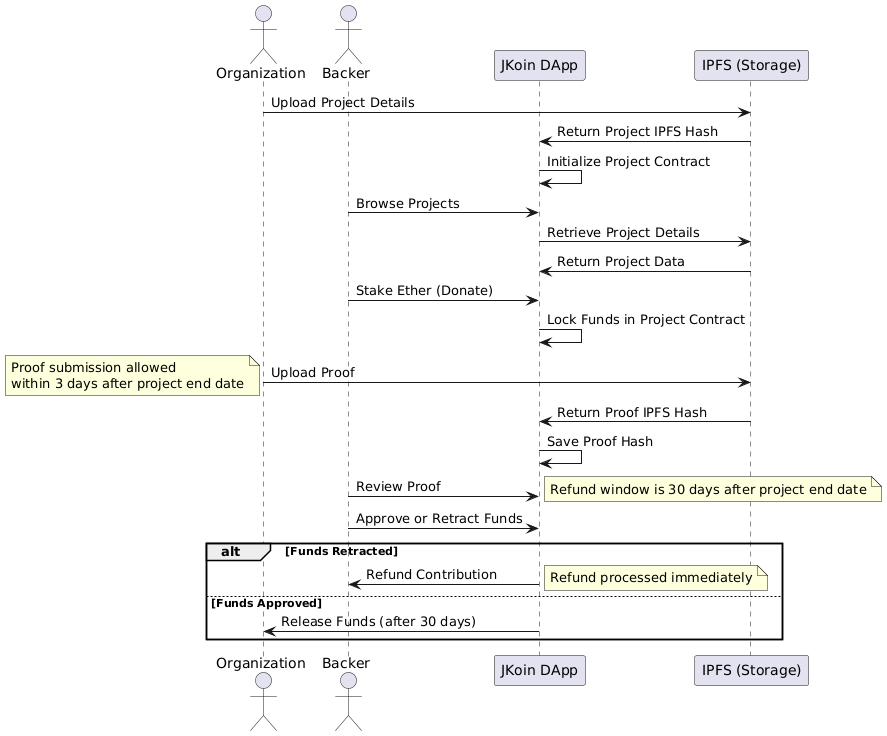

# JKoin 🌍

## Overview
**JKoin** is a decentralized crowdfunding platform designed to support sustainability-focused projects. Built on blockchain technology, it ensures transparency and trust between donors and project organizers.

## How It Works
1. **Project Creation**: Organizations create projects and specify funding goals and deadlines.
2. **Donation**: Donors contribute to projects via smart contracts.
3. **Proof Submission**: Organizations submit evidence of project completion (e.g., images, documents).
4. **Review Period**: Donors review the proof and vote to release or deny funds.
5. **Fund Distribution**: Approved funds are released to the organization. If denied, donors can withdraw their contributions.

Below is the sequence diagram illustrating the workflow of JKoin:



## Tech Stack
- **Frontend**: React.js
- **Blockchain**: Solidity, Web3.js
- **Database**: IPFS (for proof storage)

## Getting Started

Follow these steps to set up and run the project:

### Prerequisites
- **MetaMask**: Ensure MetaMask is installed and open in your browser.
- **Environment Variables**: Add a `.env` file to the root directory with the following keys:
  - Infura keys
  - IPFS storage keys

### Installation
1. Clone the repository:
   ```bash
   git clone <repository-url>
2. Add the .env file we have submitted in edimensions to the root directory, then run:
   ```bash
   cd <repository-folder>
   npm install
   npm run start

